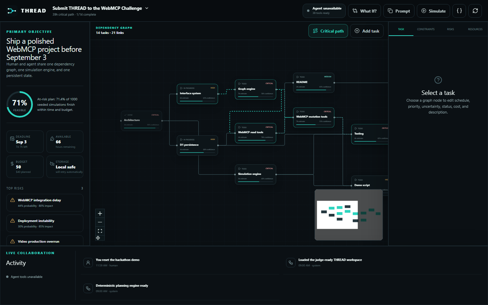
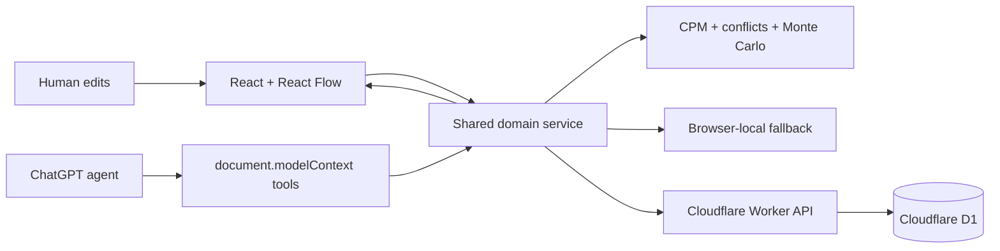

# THREAD

An agent-native execution graph for humans and AI.

Traditional agents navigate interfaces. THREAD gives them tools.

Humans and AI manipulate the same plan, simulate its future, identify failure points, and continuously replan.

**Live app:** [https://thread.rylogix.com](https://thread.rylogix.com)  
**WebMCP debugger:** [https://thread.rylogix.com/debug/webmcp](https://thread.rylogix.com/debug/webmcp)

## Why THREAD

Static plans fail when reality changes. THREAD makes the plan a shared computational workspace:

- The graph is editable by people and exposed as structured tools to an agent.
- Manual and WebMCP actions call the same validated domain services.
- Critical path, conflicts, bottlenecks, feasibility, and Monte Carlo forecasts use real plan data.
- Cloudflare D1 persists normalized state; localStorage preserves the demo when the network fails.
- A seeded, no-login judge experience is ready in one click.

The judge workspace starts at **71.4%** on-time probability using seed `20,260,903`. Deterministic scope and uncertainty reductions can raise the same calculation above 90%; neither result is hardcoded.



## Architecture



One atomic mutation path validates input, derives the next state, saves locally, attempts D1 persistence, publishes to React, records activity, and returns a compact result. See [ARCHITECTURE.md](./ARCHITECTURE.md).

## Tool surface

THREAD registers 38 imperative WebMCP tools through `document.modelContext.registerTool(...)`:

- 12 read tools
- 7 creation tools
- 7 focused mutation tools
- 6 analysis tools
- 4 high-level deterministic tools
- 2 scenario lifecycle tools

Every tool, schema, annotation, and example is documented in [WEBMCP.md](./WEBMCP.md). Unsupported browsers show a clear fallback while all manual features continue to work.

## Stack

- React 19, TypeScript, Vite, Tailwind CSS
- React Flow (`@xyflow/react`) and Zod
- Cloudflare Workers static assets and D1
- Vitest, Testing Library, and Playwright

No Next.js, external AI API, login, judge-owned key, or separate backend server.

## Local setup

Requirements: Node.js 22+ and pnpm 11+.

```bash
pnpm install
pnpm cf:types
pnpm dev
```

Open `http://localhost:5173`. Vite intentionally exercises the browser-local fallback because the Worker API is not running.

Run the full Worker and local D1:

```bash
pnpm build
pnpm db:migrate:local
pnpm cf:dev
```

Open `http://localhost:8787`.

## Tests

```bash
pnpm typecheck
pnpm test
pnpm build
pnpm test:e2e
pnpm cf:dry-run
```

The suite covers schemas, task lifecycle, reset, cycles, CPM, conflicts, bottlenecks, seeded simulation, scenarios, fallback reconciliation, rollback, malformed/unknown/duplicate calls, feature detection, all 38 tool execution contracts, and the complete browser judge path.

To run the deployment-gated D1 round-trip and browser journeys against production, set `PLAYWRIGHT_BASE_URL=https://thread.rylogix.com` and run `pnpm exec playwright test tests/e2e/thread.spec.ts`.

## Cloudflare deployment

The committed configuration targets `thread.rylogix.com`, binds `thread-production`, serves the SPA and API from one Worker, and adds production security headers.

```bash
pnpm build
pnpm cf:types
pnpm exec wrangler d1 migrations apply thread-production --remote
pnpm exec wrangler deploy
```

Then verify:

```bash
curl -i https://thread.rylogix.com/api/health
curl -i https://thread.rylogix.com/debug/webmcp
```

Do not commit `.dev.vars`, tokens, or secrets. The D1 database ID in `wrangler.jsonc` is a non-secret binding identifier.

## Judge demo

Use the exact prompt:

> Open THREAD and optimize this project so I have at least a 90% chance of submitting on time. Keep the budget under $50 and don't remove WebMCP functionality.

The timed story and recovery plan are in [DEMO.md](./DEMO.md). Ready-to-paste submission copy is in [SUBMISSION.md](./SUBMISSION.md).

## Repository map

```text
src/domain/        normalized schemas, seed, application service
src/engine/        critical path, conflicts, bottlenecks, feasibility, simulation
src/persistence/   remote-first repository with local fallback
src/webmcp/        imperative tool definitions and registration
src/components/    graph, panels, inspector, scenarios, debugger UI
worker/            Cloudflare Worker API and D1 repository
migrations/        versioned D1 schema
tests/             unit, integration, tool-contract, and Playwright coverage
```

## License

[MIT](./LICENSE)
