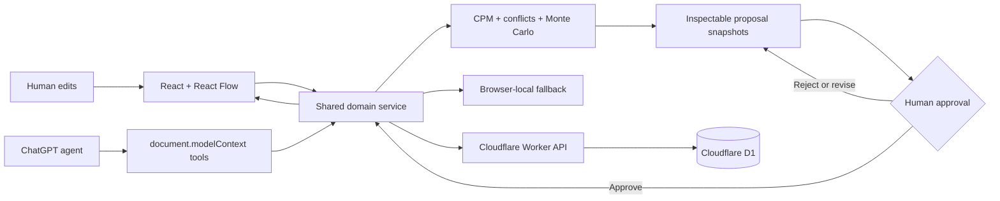

# THREAD

An agent-human plan negotiation system.

THREAD turns project planning into a negotiated, executable contract between a human and an agent. The human locks what cannot change. The agent develops several plans, simulates their consequences, and explains the tradeoffs. Only a plan the human explicitly approves enters the shared workspace.

- **Production domain:** [https://thread.rylogix.com](https://thread.rylogix.com)
- **WebMCP debugger:** [https://thread.rylogix.com/debug/webmcp](https://thread.rylogix.com/debug/webmcp)

## Why THREAD

Static plans fail when reality changes, while direct agent edits can be difficult to understand or trust. THREAD makes negotiation inspectable:

- A person locks the deadline, budget, minimum finish probability, capacity, protected work, maximum risk, and optimization preference.
- The agent creates deterministic **Safest**, **Fastest**, and **Highest-impact** proposals without changing the live graph.
- Every proposal includes structured operations and reasons, graph differences, constraint checks, critical-path changes, seeded simulation evidence, upside, and tradeoffs.
- The person compares proposals, answers a structured tradeoff question, and explicitly approves or rejects the result.
- Applying a proposal is atomic, recorded in a decision ledger, and reversible.
- The graph remains directly editable and exposed as structured tools when negotiation is not needed.
- Manual and WebMCP actions call the same validated domain services.
- Critical path, conflicts, bottlenecks, feasibility, and Monte Carlo forecasts use real plan data.
- Cloudflare D1 persists normalized state; localStorage preserves the demo when the network fails.
- A seeded, no-login judge experience is ready in one click.

The judge workspace starts at **71.4%** on-time probability using seed `20,260,903`. Proposal outcomes are computed by the same planning and simulation engines as the live workspace; they are not fabricated summaries. The memorable interaction is the boundary between agent recommendation and human authority: creating or revising a proposal is agent-accessible, while final approval is deliberately human-only.


## Architecture



One service boundary validates UI and tool input. Proposal generation operates on cloned snapshots; approval revalidates the selected proposal against the current plan revision before one atomic persisted transition. See [ARCHITECTURE.md](./ARCHITECTURE.md).

## Tool surface

THREAD's complete surface contains 46 imperative WebMCP tools registered through `document.modelContext.registerTool(...)`:

- 38 workspace, graph, analysis, simulation, mutation, and scenario tools
- 8 Decision Room tools for context, proposal creation and revision, comparison, and human decisions

There is intentionally no agent-callable approval tool. The agent can propose; only the person using the Decision Room can commit a proposal to the live plan. Every tool, schema, annotation, and example is documented in [WEBMCP.md](./WEBMCP.md). Unsupported browsers show a clear fallback while all manual features continue to work.

## Stack

- React 19, TypeScript, Vite, Tailwind CSS
- React Flow (`@xyflow/react`) and Zod
- Cloudflare Workers static assets and D1
- Vitest, Testing Library, and Playwright

No Next.js, external AI API, login, judge-owned key, or separate backend server.

## Local setup

Requirements: Node.js 22+ and pnpm 11+.

```bash
pnpm install
pnpm cf:types
pnpm dev
```

Open `http://localhost:5173`. Vite intentionally exercises the browser-local fallback because the Worker API is not running.

Run the full Worker and local D1:

```bash
pnpm build
pnpm db:migrate:local
pnpm cf:dev
```

Open `http://localhost:8787`.

## Tests

```bash
pnpm lint
pnpm typecheck
pnpm test
pnpm build
pnpm test:e2e
pnpm cf:dry-run
```

Run the complete local gate with `pnpm test:all`.

The suite is designed to cover schemas, task lifecycle, reset, cycles, CPM, conflicts, bottlenecks, seeded simulation, scenarios, fallback reconciliation, malformed/unknown/duplicate calls, proposal generation and comparison, constraint preservation, approval separation, atomic application and rollback, human decisions, tool/UI synchronization, feature detection, all tool contracts, and the complete browser judge path. Run the commands above for the current verification result.

To run the deployment-gated D1 round-trip and browser journeys against production, set `PLAYWRIGHT_BASE_URL=https://thread.rylogix.com` and run `pnpm exec playwright test tests/e2e/thread.spec.ts`.

## Cloudflare deployment

The committed configuration targets `thread.rylogix.com`, binds `thread-production`, serves the SPA and API from one Worker, and adds production security headers.

```bash
pnpm build
pnpm cf:types
pnpm exec wrangler d1 migrations apply thread-production --remote
pnpm exec wrangler deploy
```

Then verify:

```bash
curl -i https://thread.rylogix.com/api/health
curl -i https://thread.rylogix.com/debug/webmcp
```

Do not commit `.dev.vars`, tokens, or secrets. The D1 database ID in `wrangler.jsonc` is a non-secret binding identifier.

## Judge demo

After locking the non-negotiables in the Decision Room, use the exact prompt:

> Use THREAD's locked constraints to create Safest, Fastest, and Highest-impact proposals that target at least a 90% chance of finishing on time. Preserve all WebMCP functionality. Do not apply anything; ask me when a subjective tradeoff needs my decision.

The timed story and recovery plan are in [DEMO.md](./DEMO.md). Ready-to-paste submission copy is in [SUBMISSION.md](./SUBMISSION.md).

## Repository map

```text
src/domain/        normalized schemas, seed, application service
src/engine/        critical path, feasibility, simulation, proposal generation and diffs
src/persistence/   remote-first repository with local fallback
src/webmcp/        imperative tool definitions and registration
src/components/    graph, Decision Room, ledger, inspector, scenarios, debugger UI
worker/            Cloudflare Worker API and D1 repository
migrations/        versioned D1 schema
tests/             unit, integration, tool-contract, and Playwright coverage
```

## License

[MIT](./LICENSE)
